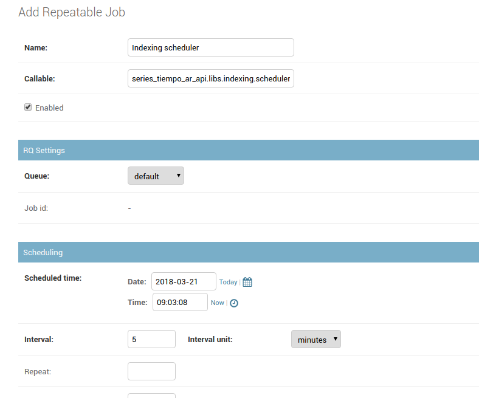
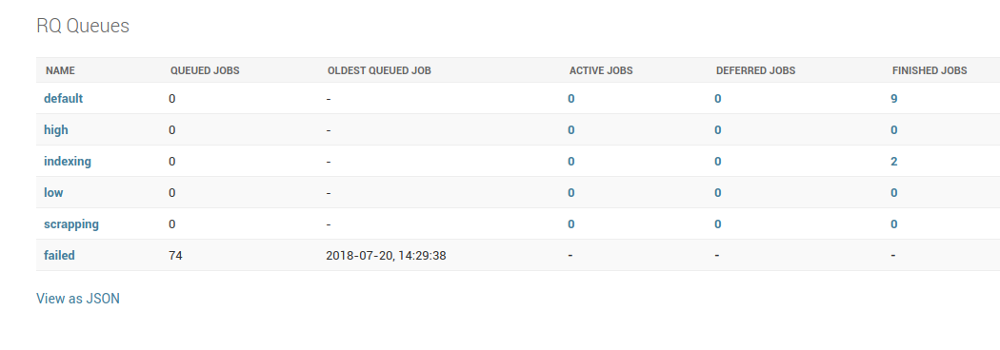

# Features del panel de administrador

## Configuración del rq-scheduler

Para asegurar la funcionalidad correcta de la indexación, es necesario agregar varios `Repeatable Job` desde el admin de Django. A continuación se muestra una configuración ejemplo. Se recomienda setear la queue a `indexing`. El scheduled time puede ser arbitrario, es ignorado.

Configurar las siguientes tareas:

- `series_tiempo_ar_api.libs.indexing.tasks.scheduler` (cada 5 minutos)
- `series_tiempo_ar_api.apps.management.tasks.schedule_api_indexing` (1 vez por día, programada para correr **despues** de schedule_new_read_datajson_task)
- `django_datajsonar.tasks.schedule_new_read_datajson_task` (1 vez por día)
- `django_datajsonar.tasks.close_read_datajson_task` (cada 5 minutos)

La vista de tareas programadas debería parecerse al siguiente ejemplo. Notar que _api indexing_ está programada a las 3 am, y _django_datajsonar indexing_ está a las 12 am, tres horas antes.

## Replanificación de tareas

En el caso de querer reconfigurar las tareas, la manera más segura de hacerlo es realizando los siguientes pasos. **No** se recomienda editar directamente la tarea.

- En la vista de _Repeatable Jobs_, ubicar el Job ID de la tarea a reprogramar (ver screenshots anteriores), y ubicarla en la vista de _finished jobs_ de `django-rq`, en la URL `/series/django-rq/`. En este ejemplo, si queremos editar el job de "datajson ar indexing", que está bajo la cola default, debemos ver el detalle de la cola haciendo click en el número `9` de _finished jobs_. Allí deberíamos poder ver el job referenciado, `1425c8c4-35d6-4d0c-b716-b3496f64f1d2`.

**Borrar** esta tarea, utilizando el menú de _Actions_ provisto en la vista de _finished jobs_, **No** el _Empty Queue_.

- Volver a la vista de _Repeatable Jobs_, y borrar la tarea que se queire editar.
- Crear la tarea nuevamente con los nuevos parámetros deseados. El _Job ID_ de la nueva tarea debería ser distinto a la anterior.

## Indexación manual de metadatos

Creando nuevos modelos `IndexMetadataTask` se lanzarán procesos asincrónicos para indexar metadatos de los nodos registrados al cluster de Elasticsearch. Un nuevo proceso de indexación no puede ser lanzado mientras haya algún otro ejecutándose. Se puede seguir el estado de la tarea corriendo a través de los campos del modelo.

