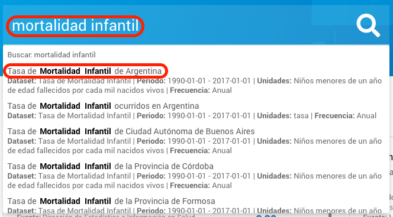
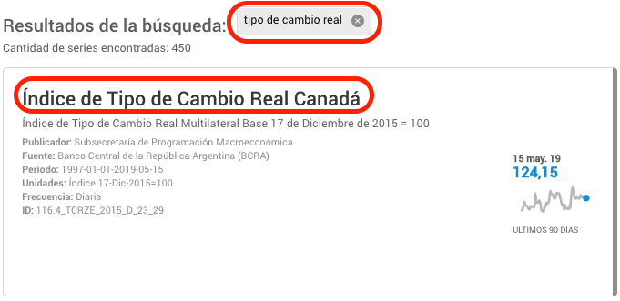
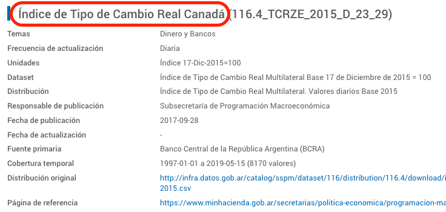

# Generar descripciones

Las descripciones de las series son el metadato más importante (después del identificador): deben dar al usuario toda la información que necesita para comprender de qué serie en particular se trata, cuando este está buscando las series que quiere.

La descripción de las series es el principal metadato que usa el buscador del explorador de series para ofrecer respuestas ante el usuario que tipea.

Es el nombre principal en los resultados de búsqueda

Es el primer metadato en el gráfico, una vez elegida una serie

 
 
Cuando se definen las descripciones de un conjunto de series de tiempo, deben cumplir con las siguientes propiedades:

## Propiedades de una buena descripción

* **No se confunde con la descripción de otra serie**. La descripción de una serie la individualiza inequívocamente de cualquier otra serie en la base.
* **Es suficiente para el usuario que busca entre miles de series distintas**. Sin necesidad de mirar otros metadatos que no sean la frecuencia temporal y las unidades de medida, el usuario debe poder entender de qué serie se trata.
* **Es consistente con descripciones de series similares**. Si existe una serie llamada "IPC Nacional. Región Noroeste. Nivel general", no debería existir "IPC Nacional. Nivel general. Región Cuyo" sino "IPC Nacional. Región Cuyo. Nivel general"

## Criterios de descripción propuestos

Algunos criterios generales:

* **Capitalizar todas las palabras significativas**. Todas las que no son artículos o preposiciones. Ej.: "Tasa de Natalidad de la Provincia de Entre Ríos" en lugar de "Tasa de natalidad de la provincia de Entre Ríos"
* **Preferir la utilización de palabras completas, en lugar de abreviaturas**. Salvo que la descripción completa esté quedando demasiado larga y sea conveniente recortarla, o que la abreviatura sea de un uso tan difundido en el público general que no pueda prestarse a confusión.
* **Escribir descripciones entre 40 y 110 caracteres de largo**. Raras veces es conveniente una descripción más larga (o más corta). En ningún caso la descripción puede superar los 200 caracteres.
* **Incluir la unidad de medida, si la misma serie se publica con distintas unidades**. Si sólo se publica una serie bajo una determinada unidad de medida, esto no hace falta (Ej.: "Tasa de Natalidad. Provincia de Entre Ríos") pero debe agregarse si existen variantes ("Fuerza Aérea. Personal Femenino (Porcentaje)" / "Fuerza Aérea. Personal Femenino (Cantidad)")

### Aperturas "de mayor a menor" separadas por puntos

Se comienza con el nombre de la variable y le siguen los distintos niveles de apertura, separados con ".". La unidad de medida se pone al final y entre paréntesis porque no es un "nivel de apertura" de la variable.

* "Tasa de Natalidad. Provincia de Entre Ríos"
* "Fuerza Aérea. Personal Femenino (Porcentaje)"
* "IPC Nacional. Región Noroeste. Nivel general (Base Diciembre 2016 = 100)"
* "IPC Nacional. Total Nacional. Nivel general (Base Diciembre 2016 = 100)"
* "Transporte de Pasajeros. Servicio Regular de Aeronavegación Internacional (Miles de pasajeros)"

### Frase continua

Se compone una oración continua que contiene el nombre de la variable y sus niveles de apertura. La unidad de medida también se pone al final entre paréntesis.

* "Tasa de Natalidad de la Provincia de Entre Ríos"
* "Porcentaje del Personal Femenino de la Fuerza Aérea" o "Personal Femenino de la Fuerza Aérea (Porcentaje)"
* "Nivel General del Índice de Precios al Consumidor Nacional de la Región Noroeste (Base Diciembre 2016 = 100)"
* "Nivel General del Índice de Precios al Consumidor Nacional de Argentina (Base Diciembre 2016 = 100)"
* "Servicio Regular de Aeronavegación Internacional de Transporte de Pasajeros (Miles de Pasajeros)"
