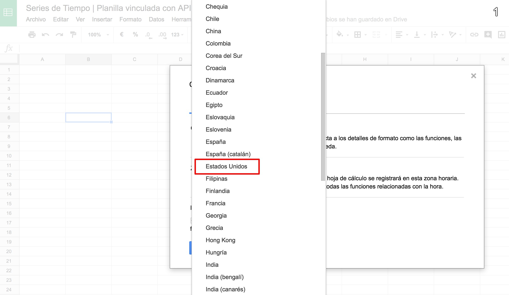
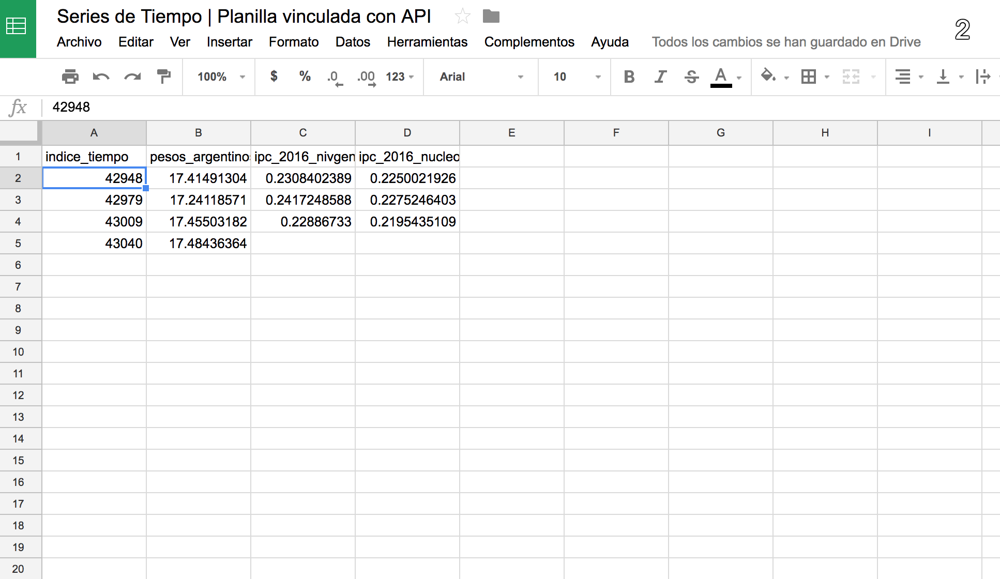
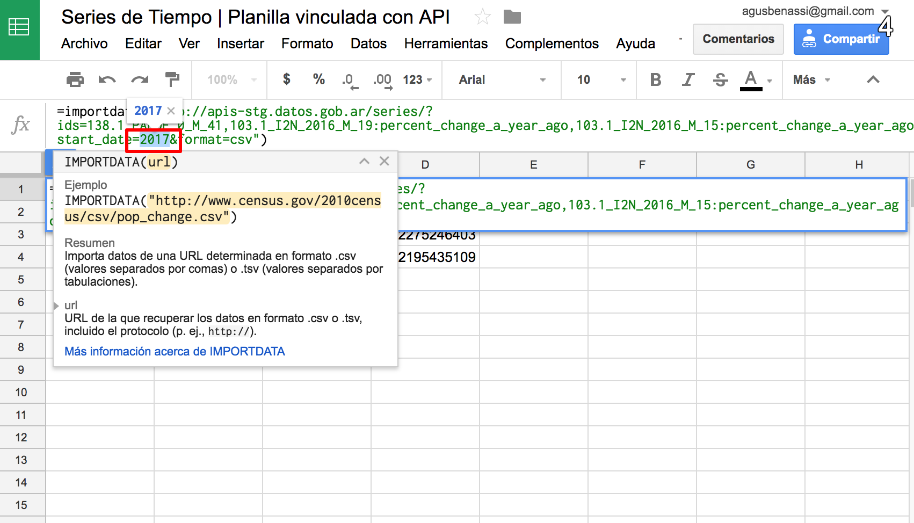
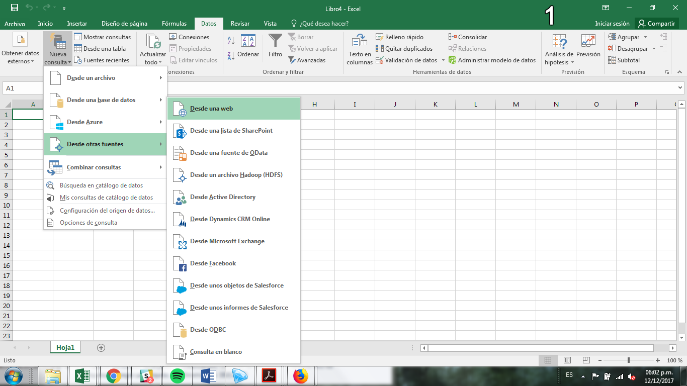
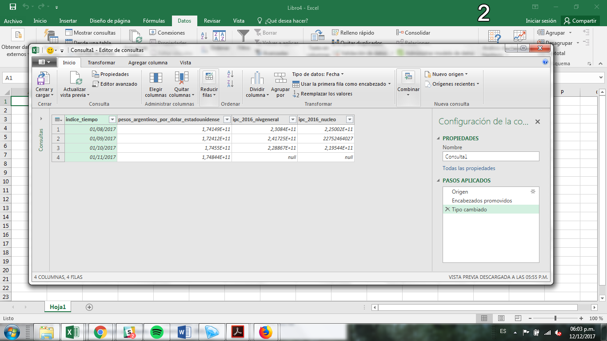

# Integración con planillas de cálculo

<!-- START doctoc generated TOC please keep comment here to allow auto update -->
<!-- DON'T EDIT THIS SECTION, INSTEAD RE-RUN doctoc TO UPDATE -->
 

- [Google Drive](#google-drive)
    - [1. Modificar la configuración regional o usar el parámetro "decimal=,"](#1-modificar-la-configuracion-regional-o-usar-el-parametro-decimal)
        - [Usar el parámetro `decimal`](#usar-el-parametro-decimal)
        - [Modificar la configuración regional](#modificar-la-configuracion-regional)
    - [2. Importar los datos a la planilla](#2-importar-los-datos-a-la-planilla)
    - [3. Elegir el formato de fecha](#3-elegir-el-formato-de-fecha)
    - [4. Modificar la URL de consulta a la API](#4-modificar-la-url-de-consulta-a-la-api)
- [Excel](#excel)
    - [0. Chequear que tenés instalado lo que necesitás](#0-chequear-que-tenes-instalado-lo-que-necesitas)
    - [1. Generar una nueva consulta desde una URL](#1-generar-una-nueva-consulta-desde-una-url)
    - [2. Editar codificación del archivo origen](#2-editar-codificacion-del-archivo-origen)
    - [3. Editar los tipos de las columnas](#3-editar-los-tipos-de-las-columnas)
    - [4. Guardar las modificaciones y cargar la consulta](#4-guardar-las-modificaciones-y-cargar-la-consulta)

<!-- END doctoc generated TOC please keep comment here to allow auto update -->

## Google Drive

### 1. Modificar la configuración regional o usar el parámetro "decimal=,"

#### Usar el parámetro `decimal`

La API genera archivos CSV usando "." como separador decimal por defecto. Si tu cuenta de Google está configurada para Argentina / latinoamérica, podés agregar a todas tus llamadas a la API el argumento `&decimal=,` para que los CSVs se generen con "," como separador decimal.

!!! note ""
    [https://apis.datos.gob.ar/series/api/series/?limit=1000&metadata=full&start=0&ids=143.3_NO_PR_2004_A_21&format=csv&decimal=,](https://apis.datos.gob.ar/series/api/series/?limit=1000&metadata=full&start=0&ids=143.3_NO_PR_2004_A_21&format=csv&decimal=,)

Ver uso del parámetro [`decimal`](reference/api-reference.md#decimal) en la referencia.

#### Modificar la configuración regional

Para que Google Spreadsheet lea correctamente el archivo CSV por defecto, puede elegirse “Estados Unidos” o cualquier otra región compatible como configuración regional.

  

  

### 2. Importar los datos a la planilla

La función IMPORTDATA() toma la URL de la consulta a la API y trae los datos a la planilla.

  

### 3. Elegir el formato de fecha

El índice de tiempo puede verse como un número la primera vez que se importan los datos. Lo más conveniente es seleccionar toda la columna y elegir el formato en el que se desea visualizar la fecha.

  

  

### 4. Modificar la URL de consulta a la API

Una vez importada la tabla por primera vez, se pueden modificar los distintos parámetros de la consulta según lo que se necesite. La tabla se actualizará con cada cambio.

  

  

## Excel

### 0. Chequear que tenés instalado lo que necesitás

* **Excel 2016**: tiene todo lo necesario para integrar una URL a un CSV.
* **Excel 2013**: necesita [descargar e instalar Microsoft Power Query](https://www.microsoft.com/es-es/download/details.aspx?id=39379).
* **Excel 2010**: necesita [descargar e instalar el Service Pack 1](https://www.microsoft.com/es-ar/download/details.aspx?id=26622) y luego [descargar e instalar Microsoft Power Query](https://www.microsoft.com/es-es/download/details.aspx?id=39379).

### 1. Generar una nueva consulta desde una URL

“Datos” > “Nueva consulta” > “Desde otras fuentes” > “Desde una web”

**Nota:** si Excel está configurado para Argentina / latinoamérica agregar a la URL de la API `&decimal=,` para que los números decimales usen "," en lugar de "." y Excel los lea correctamente. Ver uso del parámetro [`decimal`](reference/api-reference.md#decimal) en la referencia.

!!! note ""
    [https://apis.datos.gob.ar/series/api/series/?limit=1000&metadata=full&start=0&ids=143.3_NO_PR_2004_A_21&format=csv&decimal=,](https://apis.datos.gob.ar/series/api/series/?limit=1000&metadata=full&start=0&ids=143.3_NO_PR_2004_A_21&format=csv&decimal=,)

  

  

  

### 2. Editar codificación del archivo origen

Esto **sólo es necesario si se pide a la API usar las descripciones como nombres de las columnas** (`&header=descriptions`) en lugar del texto corto que viene por defecto, formado con carateres compatibles con cualquier codificación.

La API genera los archivos CSV con codificación “Unicode UTF-8”, que no es el valor por defecto de Excel y puede generar errores en los caracteres con tildes o la "ñ".

Click en la rueda de “Origen” > “Origen de archivo” > Elegir “Unicode UTF-8”

  

  

### 3. Editar los tipos de las columnas

Excel puede no interpretar correctamente las fechas cuando Excel está configurado para Argentina / latinoamérica.

Si este es el caso, se debe utilizar el “Editor avanzado” para corregir el tipo de la columna "indice_tiempo" que debe ser “type date”.

  

### 4. Guardar las modificaciones y cargar la consulta

Por último, haciendo click en “Cerrar y cargar” la consulta queda configurada en una tabla de Excel que se puede actualizar.

