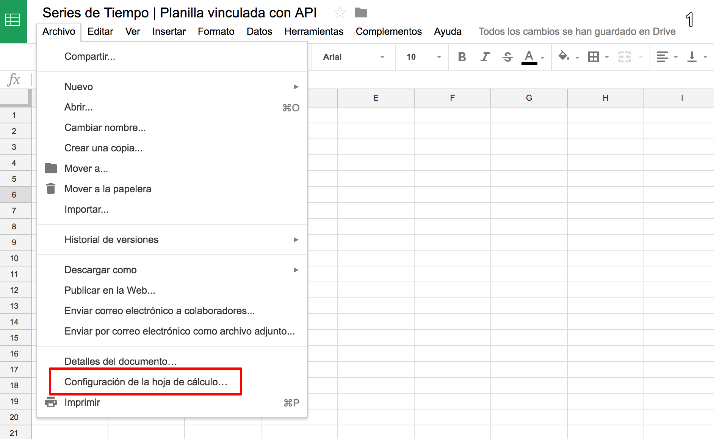
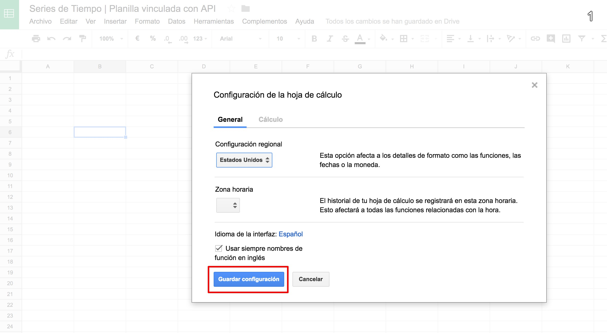
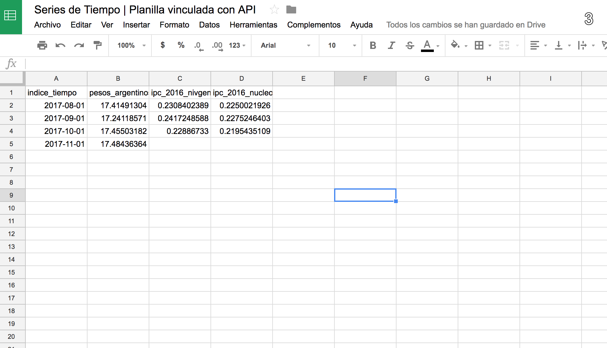
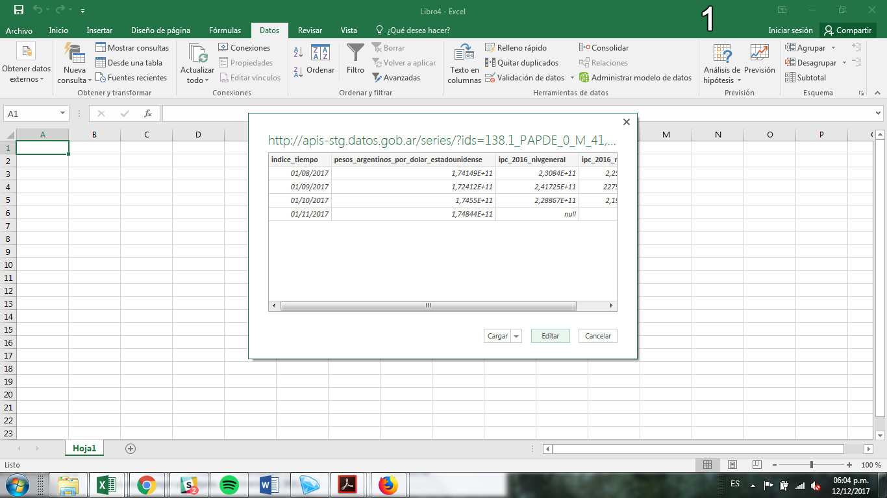
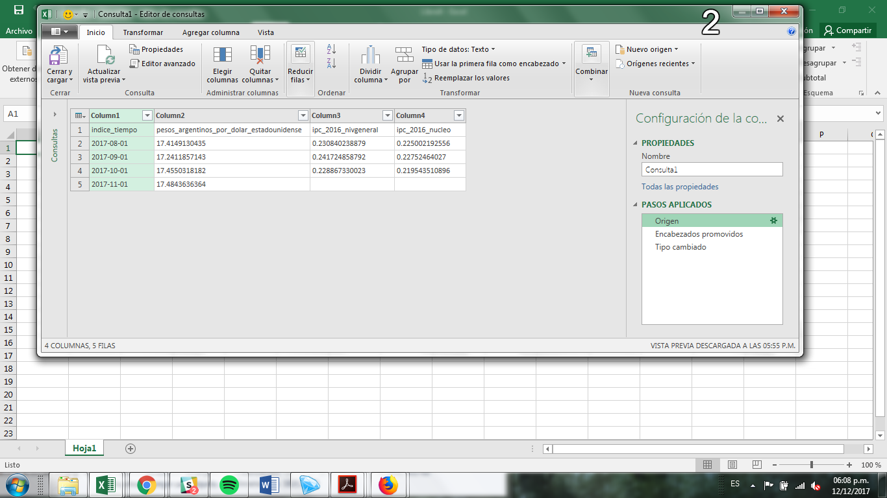
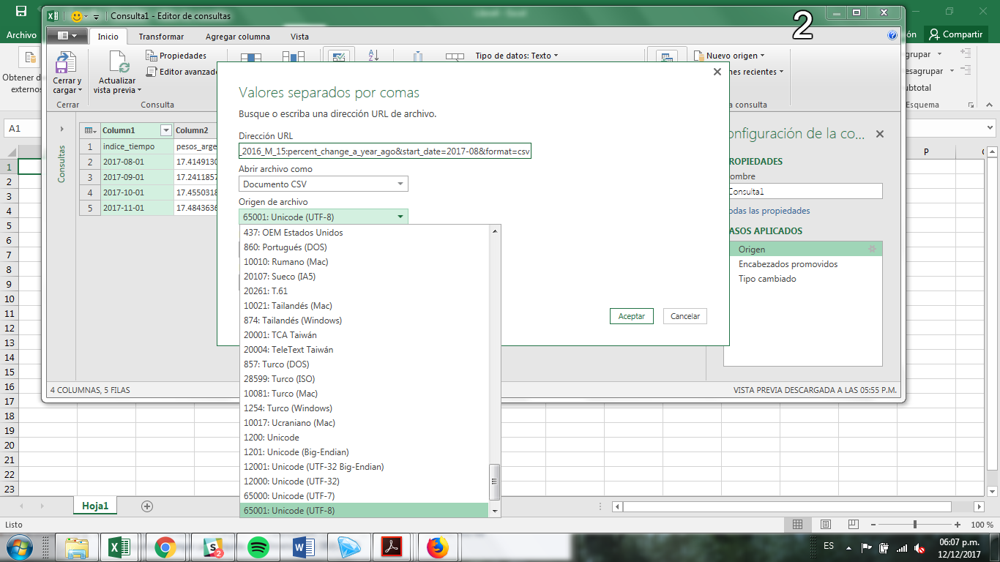
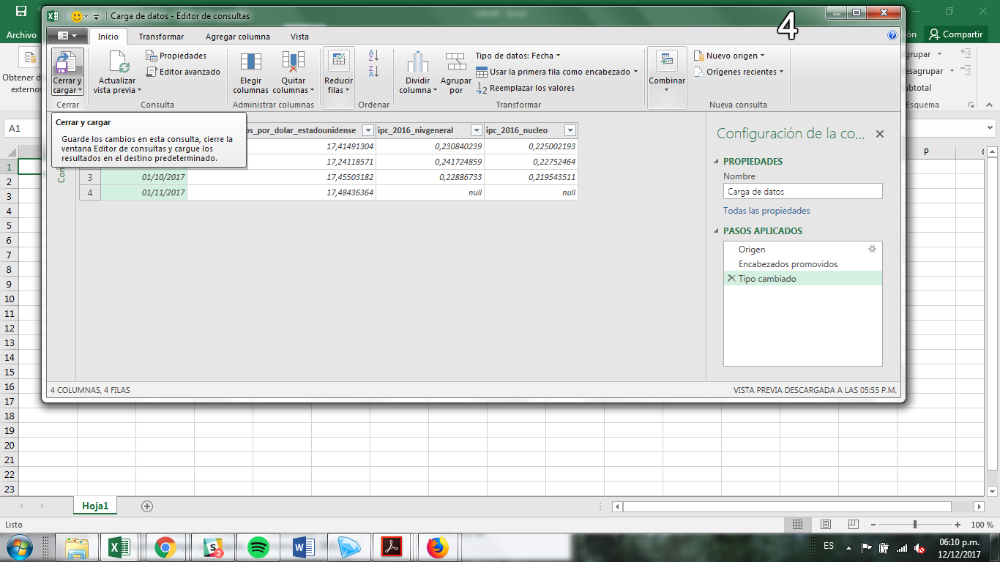
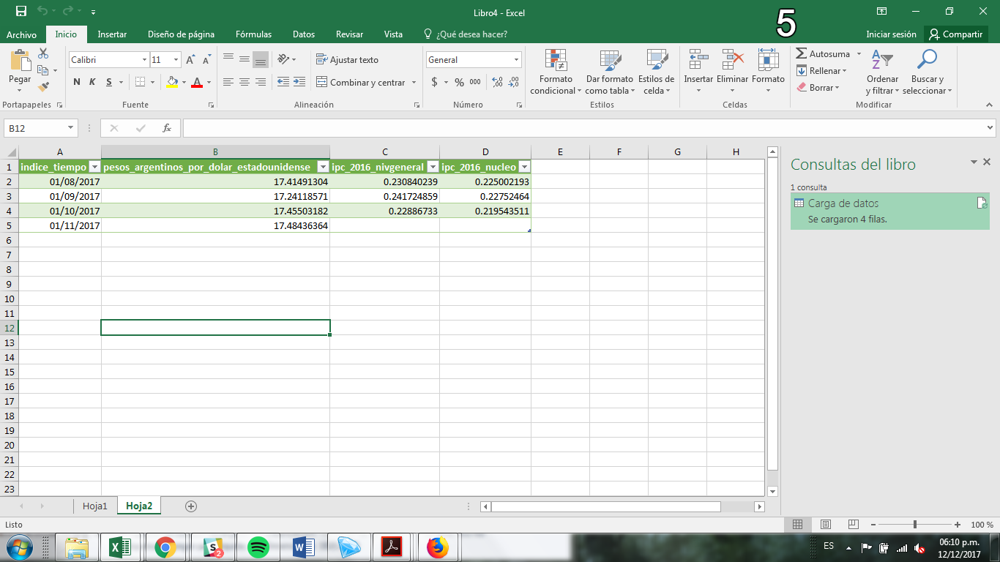

# Integración con planillas de cálculo

<!-- START doctoc generated TOC please keep comment here to allow auto update -->
<!-- DON'T EDIT THIS SECTION, INSTEAD RE-RUN doctoc TO UPDATE -->
 

- [Google Drive](#google-drive)
    - [1. Modificar la configuración regional](#1-modificar-la-configuracion-regional)
    - [2. Importar los datos a la planilla](#2-importar-los-datos-a-la-planilla)
    - [3. Elegir el formato de fecha](#3-elegir-el-formato-de-fecha)
    - [4. Modificar la URL de consulta a la API](#4-modificar-la-url-de-consulta-a-la-api)
- [Excel](#excel)
    - [1. Generar una nueva consulta desde una URL](#1-generar-una-nueva-consulta-desde-una-url)
    - [2. Editar codificación del archivo origen](#2-editar-codificacion-del-archivo-origen)
    - [3. Editar los tipos de las columnas](#3-editar-los-tipos-de-las-columnas)
    - [4. Modificar la configuración regional](#4-modificar-la-configuracion-regional)
    - [5. Guardar las modificaciones y cargar la consulta](#5-guardar-las-modificaciones-y-cargar-la-consulta)

<!-- END doctoc generated TOC please keep comment here to allow auto update -->

## Google Drive

### 1. Modificar la configuración regional

La API genera archivos CSV usando “.” como separador decimal. Para que Google Spreadsheet lea correctamente el archivo debe elegirse “Estados Unidos” o cualquier otra región compatible.

Alternativamente, se le puede pedir un separador decimal distinto a la API usando el parámetro [`decimal`](reference/api-reference.md#decimal).

  

  

### 2. Importar los datos a la planilla

La función IMPORTDATA() toma la URL de la consulta a la API y trae los datos a la planilla.

  

### 3. Elegir el formato de fecha

El índice de tiempo puede verse como un número la primera vez que se importan los datos. Lo más conveniente es seleccionar toda la columna y elegir el formato en el que se desea visualizar la fecha.

  

  

### 4. Modificar la URL de consulta a la API

Una vez importada la tabla por primera vez, se pueden modificar los distintos parámetros de la consulta según lo que se necesite. La tabla se actualizará con cada cambio.

  

  

## Excel

### 1. Generar una nueva consulta desde una URL

“Datos” > “Nueva consulta” > “Desde otras fuentes” > “Desde una web”

  

  

  

### 2. Editar codificación del archivo origen

La API genera los archivos CSV con codificación “Unicode UTF-8”, que no es el valor por defecto de Excel. Click en la rueda de “Origen” > “Origen de archivo” > Elegir “Unicode UTF-8”

  

  

### 3. Editar los tipos de las columnas

Excel puede no interpretar correctamente los tipos de las columnas de la tabla si tiene un separador decimal que no sea “.”. Se debe utilizar el “Editor avanzado” para corregir los tipos de las columnas.

* El tipo de la columna “indice_tiempo” debe ser “type date”
* El tipo del resto de las columnas (que contienen series) debe ser “type number”

  

  

  

### 4. Modificar la configuración regional

En el mismo editor avanzado, debe corregirse al final la configuración regional para que sea “en-US” y acepte “.” como separador decimal.

  

### 5. Guardar las modificaciones y cargar la consulta

Por último, haciendo click en “Cerrar y cargar” la consulta queda configurada en una tabla de Excel que se puede actualizar.

